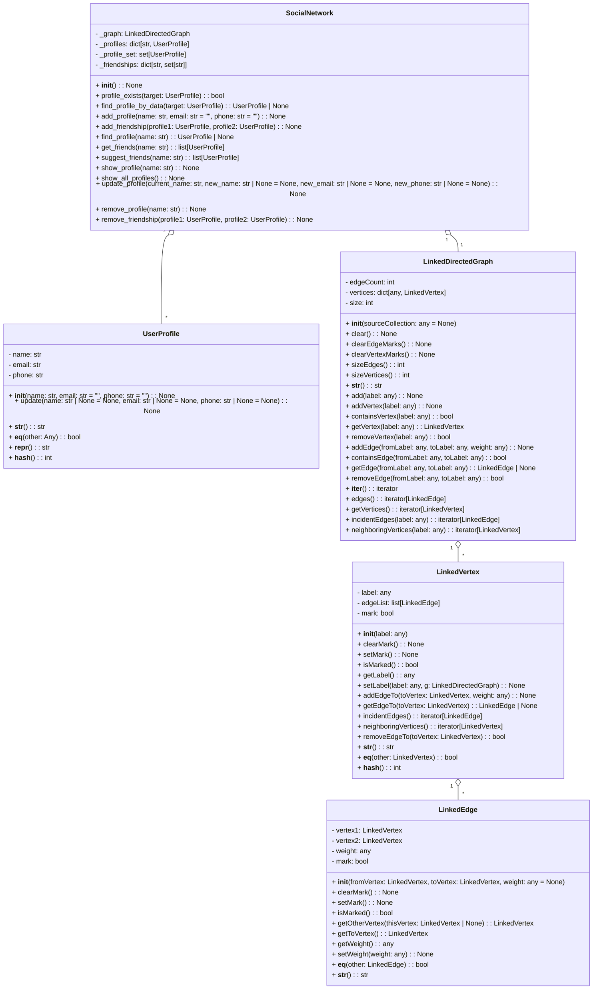

```mermaid
classDiagram
    class UserProfile {
        - name: str
        - email: str
        - phone: str
        + __init__(name: str, email: str = "", phone: str = ""): None
        + update(name: str | None = None, email: str | None = None, phone: str | None = None): None
        + __str__(): str
        + __eq__(other: Any): bool
        + __repr__(): str
        + __hash__(): int
        }

    class SocialNetwork {
        - _graph: LinkedDirectedGraph
        - _profiles: dict[str, UserProfile]
        - _profile_set: set[UserProfile]
        - _friendships: dict[str, set[str]]
        + __init__(): None
        + profile_exists(target: UserProfile): bool
        + find_profile_by_data(target: UserProfile): UserProfile | None
        + add_profile(name: str, email: str = "", phone: str = ""): None
        + add_friendship(profile1: UserProfile, profile2: UserProfile): None
        + find_profile(name: str): UserProfile | None
        + get_friends(name: str): list[UserProfile]
        + suggest_friends(name: str): list[UserProfile]
        + show_profile(name: str): None
        + show_all_profiles(): None
        + update_profile(current_name: str, new_name: str | None = None, new_email: str | None = None, new_phone: str | None = None): None
        + remove_profile(name: str): None
        + remove_friendship(profile1: UserProfile, profile2: UserProfile): None
        }  
    class LinkedEdge {
        - vertex1: LinkedVertex
        - vertex2: LinkedVertex
        - weight: any
        - mark: bool
        + __init__(fromVertex: LinkedVertex, toVertex: LinkedVertex, weight: any = None)
        + clearMark(): None
        + setMark(): None
        + isMarked(): bool
        + getOtherVertex(thisVertex: LinkedVertex | None): LinkedVertex
        + getToVertex(): LinkedVertex
        + getWeight(): any
        + setWeight(weight: any): None
        + __eq__(other: LinkedEdge): bool
        + __str__(): str
    }

    class LinkedVertex {
        - label: any
        - edgeList: list[LinkedEdge]
        - mark: bool
        + __init__(label: any)
        + clearMark(): None
        + setMark(): None
        + isMarked(): bool
        + getLabel(): any
        + setLabel(label: any, g: LinkedDirectedGraph): None
        + addEdgeTo(toVertex: LinkedVertex, weight: any): None
        + getEdgeTo(toVertex: LinkedVertex): LinkedEdge | None
        + incidentEdges(): iterator[LinkedEdge]
        + neighboringVertices(): iterator[LinkedVertex]
        + removeEdgeTo(toVertex: LinkedVertex): bool
        + __str__(): str
        + __eq__(other: LinkedVertex): bool
        + __hash__(): int
    }

    class LinkedDirectedGraph {
        - edgeCount: int
        - vertices: dict[any, LinkedVertex]
        - size: int
        + __init__(sourceCollection: any = None)
        + clear(): None
        + clearEdgeMarks(): None
        + clearVertexMarks(): None
        + sizeEdges(): int
        + sizeVertices(): int
        + __str__(): str
        + add(label: any): None
        + addVertex(label: any): None
        + containsVertex(label: any): bool
        + getVertex(label: any): LinkedVertex
        + removeVertex(label: any): bool
        + addEdge(fromLabel: any, toLabel: any, weight: any): None
        + containsEdge(fromLabel: any, toLabel: any): bool
        + getEdge(fromLabel: any, toLabel: any): LinkedEdge | None
        + removeEdge(fromLabel: any, toLabel: any): bool
        + __iter__(): iterator
        + edges(): iterator[LinkedEdge]
        + getVertices(): iterator[LinkedVertex]
        + incidentEdges(label: any): iterator[LinkedEdge]
        + neighboringVertices(label: any): iterator[LinkedVertex]
    }

    LinkedVertex "1" o-- "*" LinkedEdge
    LinkedDirectedGraph "1" o-- "*" LinkedVertex
    SocialNetwork "1" o-- "1" LinkedDirectedGraph
    SocialNetwork "1" o-- "*" UserProfile
```