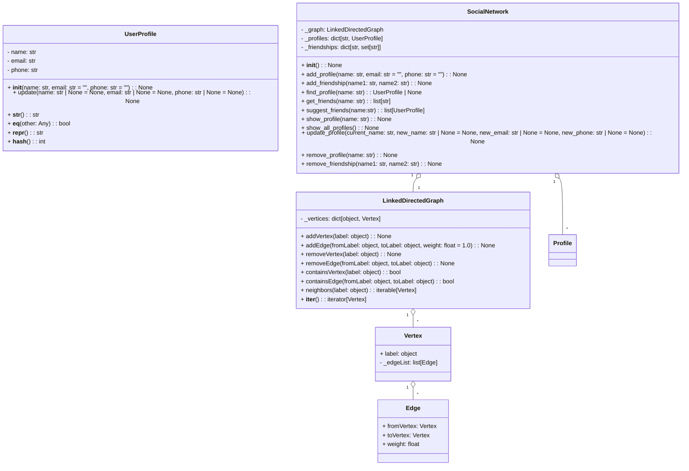

```mermaid
classDiagram
    class UserProfile {
        - name: str
        - email: str
        - phone: str
        + __init__(name: str, email: str = "", phone: str = ""): None
        + update(name: str | None = None, email: str | None = None, phone: str | None = None): None
        + __str__(): str
        + __eq__(other: Any): bool
        + __repr__(): str
        + __hash__(): int
    }

    class SocialNetwork {
        - _graph: LinkedDirectedGraph
        - _profiles: dict[str, UserProfile]
        - _friendships: dict[str, set[str]]
        + __init__(): None
        + add_profile(name: str, email: str = "", phone: str = ""): None
        + add_friendship(name1: str, name2: str): None
        + find_profile(name: str): UserProfile | None
        + get_friends(name: str): list[str]
        + suggest_friends(name:str) : list[UserProfile]
        + show_profile(name: str): None
        + show_all_profiles(): None
        + update_profile(current_name: str, new_name: str | None = None, new_email: str | None = None, new_phone: str | None = None): None
        + remove_profile(name: str): None
        + remove_friendship(name1: str, name2: str): None
    }

    class LinkedDirectedGraph {
        - _vertices: dict[object, Vertex]
        + addVertex(label: object): None
        + addEdge(fromLabel: object, toLabel: object, weight: float = 1.0): None
        + removeVertex(label: object): None
        + removeEdge(fromLabel: object, toLabel: object): None
        + containsVertex(label: object): bool
        + containsEdge(fromLabel: object, toLabel: object): bool
        + neighbors(label: object): iterable[Vertex]
        + __iter__(): iterator[Vertex]
    }

    class Vertex {
        + label: object
        - _edgeList: list[Edge]
    }

    class Edge {
        + fromVertex: Vertex
        + toVertex: Vertex
        + weight: float
    }

    SocialNetwork "1" o-- "1" LinkedDirectedGraph
    SocialNetwork "1" o-- "*" Profile
    LinkedDirectedGraph "1" o-- "*" Vertex
    Vertex "1" o-- "*" Edge
```